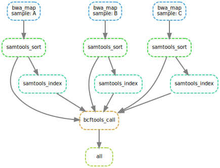

# Analysis variants pipeline

This directory contains the pipeline and the results of the variants pipeline.  
This is project is a part of the course data processing of the study Bioinformatics at Hanze University of Applied Science year 3.



## Installation

Create a python3 virtual environment and install snakemake
```
python3 -m venv {path/to/new/virtual/environment}  #create a virtualenv
source {path/to/new/virtual/environment}/bin/activate #activate the virtualenv (linux/macOS)
{path/to/new/virtual/environment}/Scripts/activate #activate the virtualenv (windows)

pip3 install snakemake {name} 

deactivate #to deactivate the virtualenv
```

## Usage

To run the pipeline activate the virtualenv as described in `installation`.  
Set the path to `{path}/DataProcessing/tutorial_02` in the activated virtualenv.

```
# Run the snakefile
snakemake --snakefile workflow/rules/main.smk --cores 2
```

## Results

The results of the pipeline can be found in the file `all.vcf` which can be found in the directory `calls`. 
And the report of the pipeline can be found in the file `out.html`. The image above shows the workflow.


## Author and support
For any information of questions please contact the author.  
Rose Hazenberg c.r.hazenberg@st.hanze.nl
