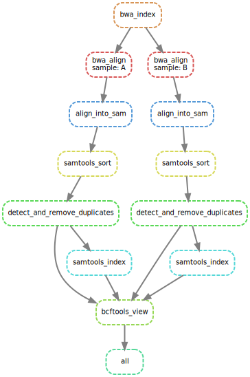

# Two pipelines

This directory contains the two pipelines and the results. The first pipeline uses an R script to generate a heatmap and the second pipeline contains different stages which has an output of a pileup.   
This is project is a part of the course data processing of the study Bioinformatics at Hanze University of Applied Science year 3.



## Installation

Create a python3 virtual environment and install snakemake
```
python3 -m venv {path/to/new/virtual/environment}  #create a virtualenv
source {path/to/new/virtual/environment}/bin/activate #activate the virtualenv (linux/macOS)
{path/to/new/virtual/environment}/Scripts/activate #activate the virtualenv (windows)

pip3 install snakemake {name} 

deactivate #to deactivate the virtualenv
```

## Usage

To run the pipeline activate the virtualenv as described in `installation`.  
Set the path to `{path}/DataProcessing/tutorial_04` in the activated virtualenv.

The snakefile needed for the heatmap is located in `workflow/rules/main.smk` and the R script is located in `workflow/scripts/scriptheatmap.R`.  
The snakefile for the pileup is located in `workflow/rules/pipeline.smk`.
```
# Run the snakefile
snakemake --snakefile workflow/rules/main.smk --cores 2 #generates the heatmap
snakemake --snakefile workflow/rules/pipeline.smk --cores 2 #generates the output of a pileup
```

## Results
The results of the heatmap can be found in the image `results/heatmap.jpg`.
The results of the pipeline can be found in the file `results/out.vcf` and the results of the stages from the pipeline are located in `aligned, filtered, results, sorted and temp`.

And the image of the pipeline can be found in the file `images/dag.svg` and is also shown above in the image.


## Author and support
For any information of questions please contact the author.  
Rose Hazenberg c.r.hazenberg@st.hanze.nl
