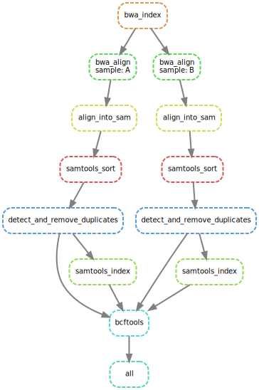

# Scheduling and logging

This directory contains a workflow and their results.    
This is project is a part of the course data processing of the study Bioinformatics at Hanze University of Applied Science year 3.



## Installation

Create a python3 virtual environment and install snakemake
```
python3 -m venv {path/to/new/virtual/environment}  #create a virtualenv
source {path/to/new/virtual/environment}/bin/activate #activate the virtualenv (linux/macOS)
{path/to/new/virtual/environment}/Scripts/activate #activate the virtualenv (windows)

pip3 install snakemake {name} 

deactivate #to deactivate the virtualenv
```

## Usage

To run the pipeline activate the virtualenv as described in `installation`.  
Set the path to `{path}/DataProcessing/tutorial_05` in the activated virtualenv.

The snakefile needed for the workflow p is located in `workflow/rules/Snakfile`. This is the main and contains the other `.smk` files to run.  

```
# Run the snakefile
snakemake --snakefile workflow/rules/Snakefile --cores 8 #this is what my laptop has for cores
snakemake --snakefile workflow/rules/Snakefile --cluster "sbatch -t {cluster.time} -p {cluster.partition} -N {cluster.nodes}" --cluster-config config/cluster_config.yaml --jobs 8 #to use slurm cluster 
```

## Results
The results of the workflow can be found in the directory `results/out.vcf` and the steps are shown in the image above and also in `images/dag.svg`.
The results of the rules from the pipeline are located in `aligned, filtered, results, sorted and temp`.
And the benchmarks and logging can be found in the directory `benchmarks and logging`. 

The results of the slurm cluster are located under `tutorial_05` and are named `slurm-{numbers}.out`.

## Author and support
For any information of questions please contact the author.  
Rose Hazenberg c.r.hazenberg@st.hanze.nl
